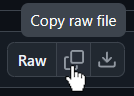

1. navigate to `src/name-of-bookmarklet.js` above
2. at the top, copy the raw file (see image below)
3. create a bookmark literally anywhere
4. edit the bookmark (right click > edit)
5. paste into the `URL` field, overwriting whatever is there.
6. click your new bookmark to trigger the code

